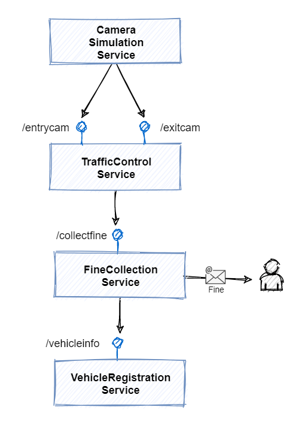
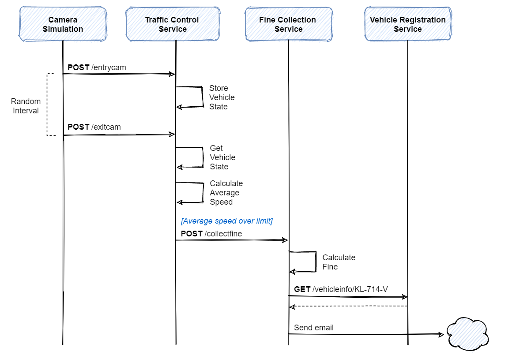
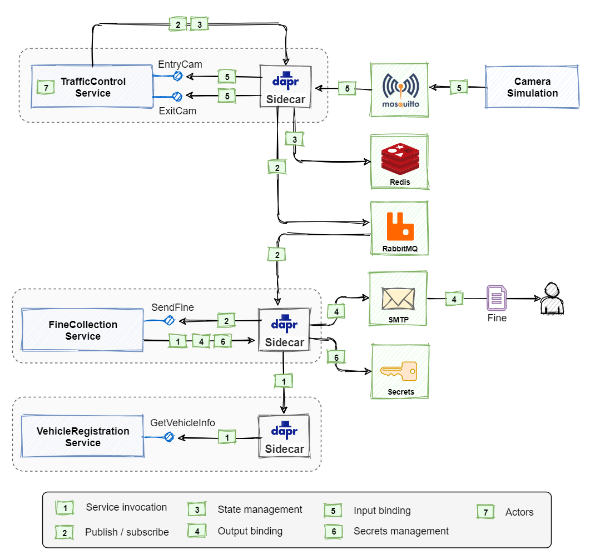

# [交通控制示例应用程序讲解](https://docs.microsoft.com/zh-cn/dotnet/architecture/dapr-for-net-developers/sample-application)

## 微服务结构

>+ 摄像头仿真服务(Camera Simulation Service)
>   + 记录车辆的经过时的速度 
>   + 一般至于一段路的出入口位置
>   + 采集信息后提交到交通控制服务
>+ 交通控制服务(Traffic Control Service)
>   + 提供摄像头出入口录入信息接口(终结点)
>   + 计算车辆超速情况，并提交给下一个服务
>+ (Fine Collection Service)
>   + 向超速车辆司机发生罚款通知
>   + 提供发送信息的接口(终结点)
>+ 车辆信息服务(Vehicle Registration Service)
>   + 提供获取车辆信息的接口(终结点)
>+ 官方微服务结构图：
> 
>+ 官方微服务调用流程
> 

## Dapr构建
> 
>   + 1. 服务注册(Service invocation)
>       + dapr sidecar 负责服务之间的信息注册
>   + 2. 发布订阅(Publish/subscribe)
>       + 发送处罚信息是不需要实时反馈的，所以用队列比较合适。
>   + 3. 状态管理(State management)
>       + 由于先记录入口时间，等到出口时间出来后才能计算是否超速，所以需要先把入口时间记录起来，这里用的redis
>   + 4. 输出绑定(Output binding)
>       + 本服务需要将数据输出
>   + 5. 输入绑定(Input binding)
>       + 本服务需要提供输入接口(终结点)
>   + 6. 安全管理(Secrets management)
>   + 7. 执行资源(Actors)
>       + 执行组件，类似于函数，有输入输出
>       + 