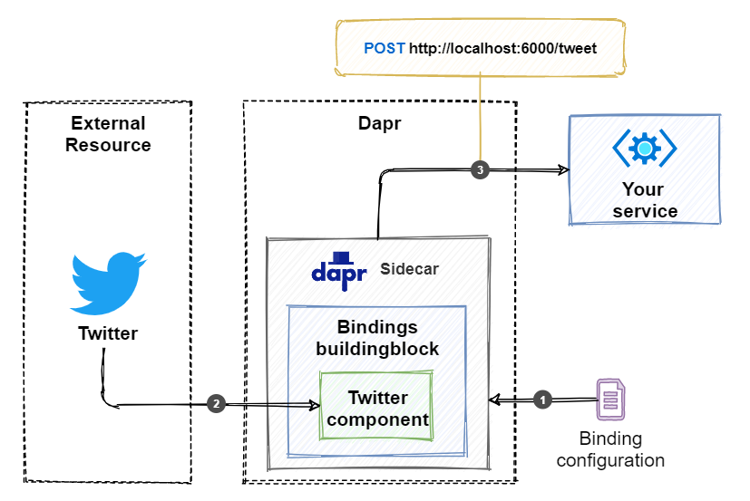

# [绑定](https://docs.microsoft.com/zh-cn/dotnet/architecture/dapr-for-net-developers/bindings)

# 绑定和发布订阅的区别
    + 发布/订阅模式依赖于消息队列，，强调异步通信
    + 绑定主要应用于软件平台之间的系统对接，在微服务应用程序之外的不同应用程序、数据存储和服务之间交换信息。

# 工作原理
 Dapr根据Yaml文件绑定外部资源

# 输入绑定
    外部资源调用服务网格接口

## 示例
+ 流程图
    


+ 步骤说明
    + Dapr边车读取绑定的配置文件生成接口
    + 在发布推文时，会调用Dpar边车接口
    + Dpar边车将数据转发到微服务接口
    + Dapr边车根据微服务接口执行情况返回执行状态

```C#
[ApiController]
public class SomeController : ControllerBase
{
    public class TwitterTweet
    {
        [JsonPropertyName("id_str")]
        public string ID {get; set; }

        [JsonPropertyName("text")]
        public string Text {get; set; }
    }

    [HttpPost("/tweet")]
    public ActionResult Post(TwitterTweet tweet)
    {
        // Handle tweet
        Console.WriteLine("Tweet received: {0}: {1}", tweet.ID, tweet.Text);

        // ...

        // Acknowledge message
        return Ok();
    }
}
```
# 输出绑定
## 示例
+ 流程图

+ 步骤说明
    + Dapr边车读取绑定的配置文件，其中包含外部资源的连接信息
    + 应用程序调用Dapr边车接口
    + Dapr边车调用外部信息接口发送数据
# Dapr .NET SDK 的使用
```C#
private async Task SendSMSAsync([FromServices] DaprClient daprClient)
{
    var message = "Welcome to this awesome service";
    var metadata = new Dictionary<string, string>
    {
      { "toNumber", "555-3277" }
    };
    await daprClient.InvokeBindingAsync("sms", "create", message, metadata);
}
```
# 绑定组件
可以使用 YAML 配置文件配置绑定。如果没有你需要的绑定组件，可以自己开发。 下面是用于 Twitter 绑定的一个示例配置：
```Yaml
apiVersion: dapr.io/v1alpha1
kind: Component
metadata:
  name: twitter-mention
  namespace: default
spec:
  type: bindings.twitter
  version: v1
  metadata:
  - name: consumerKey
    value: "****" # twitter api consumer key, required
  - name: consumerSecret
    value: "****" # twitter api consumer secret, required
  - name: accessToken
    value: "****" # twitter api access token, required
  - name: accessSecret
    value: "****" # twitter api access secret, required
  - name: query
    value: "dapr" # your search query, required
```