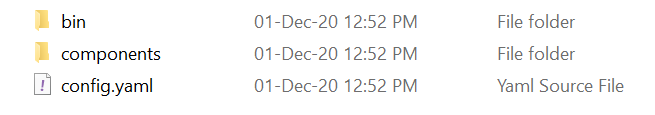

# 下载
`powershell -Command "iwr -useb https://raw.githubusercontent.com/dapr/cli/master/install/install.ps1 | iex"
`
# Dapr 命令查询

`dapr`

>  dapr [command]

|命令参数|命令说明|
|---|---|
|completion     |Generates shell completion scripts|
|components     |List all Dapr components. Supported platforms: Kubernetes|
|configurations |List all Dapr configurations. Supported platforms: Kubernetes|
|dashboard      |Start Dapr dashboard. Supported platforms: Kubernetes and self-hosted|
|help           |Help about any command|
|init           |Install Dapr on supported hosting platforms. Supported platforms: Kubernetes and self-hosted|
|invoke         |Invoke a method on a given Dapr application. Supported platforms: Self-hosted
|list           |List all Dapr instances. Supported platforms: Kubernetes and self-hosted|
|logs           |Get Dapr sidecar logs for an application. Supported platforms: Kubernetes|
|mtls           |Check if mTLS is enabled. Supported platforms: Kubernetes|
|publish        |Publish a pub-sub event. Supported platforms: Self-hosted|
|run            |Run Dapr and (optionally) your application side by side. Supported platforms: Self-hosted|
|status         |Show the health status of Dapr services. Supported platforms: Kubernetes|
|stop           |Stop Dapr instances and their associated apps. . Supported platforms: Self-hosted|
|uninstall      |Uninstall Dapr runtime. Supported platforms: Kubernetes and self-hosted|
|upgrade        |Upgrades a Dapr control plane installation in a cluster. Supported platforms: Kubernetes|
| -h, --help      |help for dapr|
| -v, --version   |version for dapr|

# Dapr 命令初始化

`dapr init`

>步骤：
>+ 创建Redis容器实例：进行状态管理和消息传递
>+ 创建Zipkin容器实例：收集跟踪
>+ 创建Dapr Placement服务容器实例
>+ Dapr文件夹(.dapr)
>   * state store
>   * elevated 
>   * zipkin 
> 

# 验证Dapr 版本
`dapr --version`

# 验证Dapr初始化的Docker容器
`docker ps`

|CONTAINER ID|IMAGE|COMMAND|CREATED|STATUS|PORTS|NAMES|
|---|---|---|---|---|---|---|
|4212c0a03042|openzipkin/zipkin|"start-zipkin"|2 minutes ago|Up 2 minutes (healthy)|9410/tcp, 0.0.0.0:9411->9411/tcp|dapr_zipkin|
|da5872fdd00e|daprio/dapr:1.6.1|"./placement"|4 minutes ago|Up 4 minutes|0.0.0.0:6050->50005/tcp|dapr_placement|
|7b8724a79465|redis|"docker-entrypoint.s…"|46 minutes ago|Up 46 minutes|0.0.0.0:6379->6379/tcp|dapr_redis|